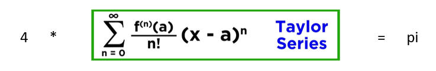
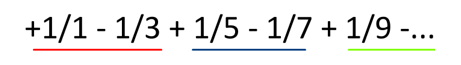
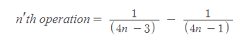
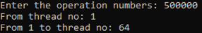

# Calculating π(pi) number with Taylor Series using Multi Threads

Pi is the ratio of the circumference of a perfect circle to the diameter of that circle. The value of pi is approximately 3.14. But its decimal neither ends (like 1/5 = 0.2) nor becomes repetitive (1/9 = 0.11111...). It never ends (at least known today like this). With the help of computers, we now know more than the first six billion digits of pi.
 
There are several ways to calculate or try to approximate the pi. One of the ways of approximate pi is using Taylor Series. Multiplying this series with 4 gives us the value of pi.

> Longer Taylor series -> More accurate pi number.

  

Let’s handle this by using the computer. We can divide the Taylor Series into parts that would be easy for a computer to calculate. For example:

  

We can divide this series into the parts that these parts contain 1 subtraction operation. And at the last, we can add all the parts and get the result. Let’s call this subtraction an “operation”. That means that n-th operation is:

  

This case would be easier to program.

 

## How to do this operation using Multi Threads?

In this problem, we can divide the specific number of operations into the different threads to calculate all separately. For example:
 
For 5 000 operations and 5 threads, we can give 1 000 operations to each thread. All operations will be added to the total sum number and at the end of all operations, we can get the total sum of according operations. Because of the add operation, they will never intersect.

**What about if a number of threads are not going to divide into a number of operations perfectly?**
The latest hero thread will handle the remaining operations to finish it. For example:
 
For 5 000 operations and 6 threads, we will give 833 operations to the first 5 threads and 835 to the latest 6’th thread.
 
Our C code generates a stat.txt file that contains the statistics about operations for different thread numbers.
 
When we run the code, it takes the operation, thread range numbers as an input, and generate this file.

  

